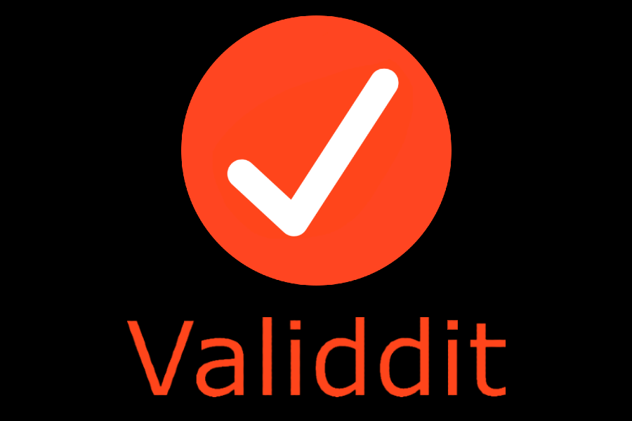

    
    <h2 align=center>an unofficial validity checker for Reddit.</h2>
    <h4

# About
Validdit is a fact-checking service that assists users who browse Reddit for their news. Due to the interactive nature of Reddit of allowing any user to submit posts and the generalized rules of news subreddits that govern what one can or cannot post, Reddit breeds opportunity for misinformation. Validdit comes into play by showing the user useful information about the post, such as the upvote/downvote ratio, info/history about the poster, comments with links to other news articles, and comments that contain keywords that may question or help verify the validity of the post.
